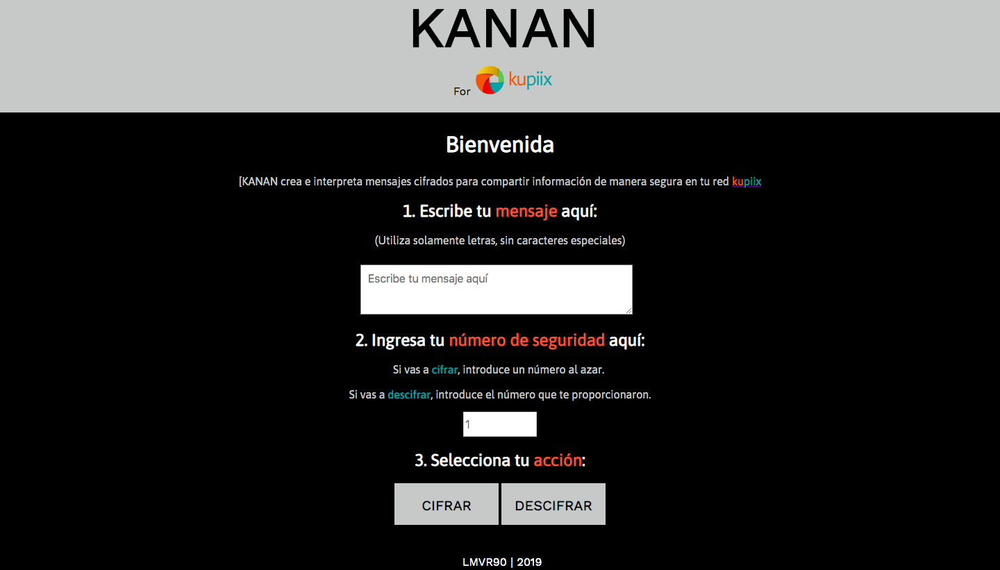
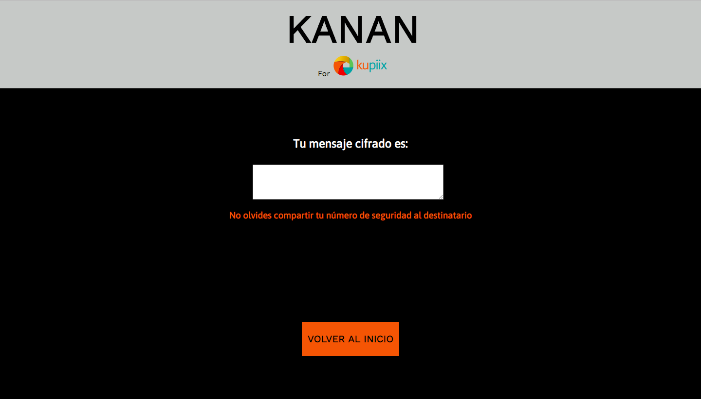

<!--
Quiénes son los principales usuarios de producto. Cómo se pensó en ellos. Cuál fue el proceso para definir el producto final a nivel de experiencia y de interfaz. Decisiones de diseño. Explicar cómo descargar, instalar y ejecutar la aplicación.
-->

# KANAN

## Introducción

KANAN es una aplicación de cifrado y descifrado de mensajes creada para la empresa [Kupiix](http://www.kupiix.com.mx/). _Kupiix_ es una empresa 100% mexicana orientada al diseño de soluciones que permiten monitorear o vigilar, automatizar y proteger tu casa. 

### Creación de KANAN para Kupiix

Kupiix busca ofrecer experiencias de seguridad cada vez más completas a sus usuarias. La protección de los hogares al 100% es prioridad para la empresa, para ello continuamente buscan innovar para resolver las necesidades de sus usuarios de manera integral.

El monitoreo de inmuebles se genera a través de la instalación de sensores que permiten alertar al residente, mediante una aplicación móvil, sobre detección de movimiento, apertura de puertas o ventanas, inundación, humo y fugas de gas.

La automatización ocurre instalando conexiones eléctricas inteligentes que permiten, desde un clic en una aplicación móvil, encender o apagar luces de las habitaciones y controlar el encendido o apagado de múltiples electrodomésticos y dispositivos eléctricos en general.

Para la protección de inmuebles, se integra un seguro de hogar con coberturas que protegen al cliente por robos y siniestros. Proveen además, asistencia de plomería, cerrajería y sistemas eléctricos.

El despliegue de estos servicios por parte de _Kupiix_ implica el compartir información que directa e indirectamente puede comprometer la seguridad de los hogares que _Kupiix_ protege. Con la implementación de KANAN en los canales de comunicación de la red de _Kupiix_, se estará reforzando el intercambio de esta información de manera segura. Al resguardar esta información con el cifrado de KANAN, tanto usuarios, como personal de la empresa podrán contar con mayor protección y confianza.

Inicialmente, KANAN será probado entre los miembros del equipo de trabajo de _Kupiix_. En una siguiente etapa, una vez que se compruebe su funcionalidad y se realicen los ajustes necesarios, la app se ampliará a la comunicación entre equipo de trabajo y clientes de la empresa para ser ofrecida como uno más de los servicios de protección de _Kupiix_.

***

## Funcionalidad

KANAN sirve para cifrar y descifrar mensajes que se intercambian entre la red _Kupiix_, tanto agentes de la empresa como los clientes que adquieren sus servicios y productos. La app permite cifrar y descifrar los mensajes en los que se comparte información que compromete la seguridad de las personas y los inmuebles asegurados.

Se trata de una aplicación muy ligera que las usuarias podrán tener instalada en sus computadoras y dispositivos móviles. KANAN es una aplicación simple y ágil. Ideal para complementar el sistema de mensajería preferido por cada usuaria y miembro del equipo _Kupiix_.

KANAN funciona en los siguientes pasos:

1. Al abrir la aplicación aparece la pantalla de inicio en la que están los campos necesarios para la interacción con el usuario:


- Introducir mensaje.


- Introducir número de seguridad. Este número es el que el programa utiliza como _offset_ para cifrar y descifrar el mensaje. Si la usuaria quiere cifrar un mensaje, ella debe definir el número y luego compartirlo al destinatario. Si la usuaria quiere descifrar, ella debe haber recibido el número de seguridad e introducirlo en este espacio.


- Dar click en el botón que indica la acción que quiere realizar.


2. Al dar click en el botón de acción, aparece la pantalla con el resultado. El mensaje aparece en una caja de texto para facilitar su selección y copiado para luego ser pegado en el cuerpo del mensaje de la aplicación de mensajería que la usuaria prefiera.

La aplicación será presentada de manera personal al equipo y usuarias _Kupiix_ para explicar su funcionameiento y entregar directamente el link y la llave de acceso para su descarga. Esto forma parte del protocolo de seguridad que _Kupiix_ busca mantener en sus operaciones y servicios.

La aplicación será exclusivamente para uso de _Kupiix_. Con fines demostrativos, se puede acceder a la aplicación aquí: [KANAN](https://lmvr90.github.io/MEX-008-Cipher/src)

***

## Diseño

Las decisiones de diseño fueron tomadas en colaboración con una agente del área de Ventas y éxito del cliente de _Kupiix_.

### El nombre

_Kupiix_ es un acrónimo que se formó de dos palabras mayas, su significado es: "casa protegida". Al crear esta app, retomamos la inspiración en la lengua maya y en ella econtramos la palabra "kanan", que significa "cuidar" o "guardar". 

### La imagen

Decidimos retomar la paleta de colores _Kupiix_, en combinación con gris, blanco y negro. Estos colores transmiten seriedad, sencillez y seguridad, en sintonía con los objetivos de nuestra aplicación. El toque de color que permite transmitir familiaridad a las usuarias, lo dan los colores de _Kupiix_, al mismo tiempo que permiten sentirnos dentro del entorno seguro de la empresa.

### Sencillez y agilidad

Como se mencionó anteriormente, KANAN es una aplicación que complementa la mensajería. Eso, aunado al cuidado de la seguridad, nos llevó a crear una app muy sencilla y de uso ágil. Básicamente consta de dos pantallas: la de inicio/interacción y la de resultado.

En ellas se visualizan las instrucciones e inputs claramente, así como los botones de acción para cumplir con las funciones requeridas.

### Prototipos

Primero se realizó un wireframe a partir del flujo de acciones.
Después se comenzó a darle diseño en CSS, aplicando la paleta de colores de manera básica.
Finalmente se tuve una reunión con la agente de _Kupiix_ para trabajar sobre la primer propuesta y crear la versión final al momento, de la imagen de KANAN.

Se pueden ver las tres etapas principales de diseño:

- Wireframe del prototipo en MARVEL: [Prototipo KANAN](https://marvelapp.com/c244bch/screen/58251317)

- Primer versión con estilos:

 



- Versión final de [KANAN](https://lmvr90.github.io/MEX-008-Cipher/src)

---
---

# Cifrado César

Cifrar significa codificar. El [cifrado César](https://en.wikipedia.org/wiki/Caesar_cipher) es uno de los primeros métodos de cifrado conocidos. El emperador romano Julio César lo usaba para enviar órdenes secretas a sus generales en los campos de batalla.


El cifrado césar es una de las técnicas más simples para cifrar un mensaje. Es un tipo de cifrado por sustitución, es decir que cada letra del texto original es reemplazada por otra que se encuentra un número fijo de posiciones (desplazamiento) más adelante en el mismo alfabeto.

Por ejemplo, si usamos un desplazamiento (_offset_) de 3 posiciones:

- La letra A se cifra como D.
- La palabra CASA se cifra como FDVD.
- Alfabeto sin cifrar: A B C D E F G H I J K L M N O P Q R S T U V W X Y Z
- Alfabeto cifrado: D E F G H I J K L M N O P Q R S T U V W X Y Z A B C

En la actualidad, todos los cifrados de sustitución simple se descifran con mucha facilidad y, aunque en la práctica no ofrecen mucha seguridad en la comunicación por sí mismos; el cifrado César sí puede formar parte de sistemas más complejos de codificación, como el cifrado Vigenère, e incluso tiene aplicación en el sistema ROT13.

## Resumen del proyecto

¿Qué tengo que hacer exactamente? En este proyecto crearás la primera aplicación web del _bootcamp_. Servirá para que el usuario pueda cifrar y descifrar un texto indicando un desplazamiento específico de caracteres (_offset_).

La temática es libre. Tú debes pensar en qué situaciones de la vida real se necesitaría cifrar un mensaje y pensar en cómo debe ser esa experiencia de uso (qué pantallas, explicaciones, mensajes, colores, ¿marca?) etc. Algunas ideas de ejemplo:

- Crear claves seguras para el email.
- Encriptar/cifrar una tarjeta de crédito.
- Herramienta de mensajería interna de una organización de derechos humanos en una zona de conflicto.
- Mensajería secreta para parejas.


## Consideraciones generales

- Este proyecto se debe resolver de manera individual.
- El proyecto será entregado subiendo tu código a GitHub (commit/push) y la interfaz será desplegada usando GitHub pages. Si no sabes lo que es GitHub, no te preocupes, lo aprenderás durante este proyecto.
- Tiempo para completarlo: 2 semanas divididas en 2 sprints (1 entrega cada viernes)

## Objetivos de aprendizaje

En este proyecto aprenderás a construir una aplicación web que interactúe con el usuario a través del navegador y la lógica basada en esa interacción. Dicho en palabras sencillas, aprenderás a:

- Pintar elementos de formulario en la pantalla usando **HTML** y **CSS**.
- Permitir al usuario interactuar (**eventos del DOM**) y hacer algo cuando ocurran dichos eventos (cifrar/descifrar).
- Manipular _**strings**_ (cadenas de texto).
- Usar **control de flujo** (bucles, condicionales, ...).
- Actualizar la pantalla con los resultados (**manipular el DOM**).
- **Implementar funciones** dada una descripción de su comportamiento.
- Verificar tu implementación con **pruebas unitarias**.
- Entender las **necesidades del usuario** y cómo proponer una solución.
- Organizar tu tiempo y priorizar tareas en un entorno de **alta incertidumbre**.

## Parte Obligatoria

Usa este alfabeto simple (solamente mayúsculas y sin ñ):

- A B C D E F G H I J K L M N O P Q R S T U V W X Y Z

#### Definición del producto

En el README.md, cuéntanos cómo pensaste en los usuarios y cuál fue tu proceso para definir el producto final a nivel de experiencia y de interfaz.

- Quiénes son los principales usuarios de producto.
- Cuáles son los objetivos de estos usuarios en relación con tu producto.
- Cómo crees que el producto que estás creando está resolviendo sus problemas.

#### Interfaz de usuario (UI)

La interfaz debe permitir al usuario:
- Elegir un desplazamiento (_offset_) indicando cuántas posiciones queremos que el cifrado desplace cada caracter.
- Insertar un mensaje (texto) que queremos cifrar.
- Ver el resultado del mensaje cifrado.
- Insertar un mensaje (texto) a descifrar.
- Ver el resultado del mensaje descifrado.

#### Scripts / Archivos

* `README.md`: debe explicar cómo descargar, instalar y ejecutar la aplicación
  así como una introducción a la aplicación, su funcionalidad y decisiones de
  diseño que tomaron.
* `src/index.html`: este es el punto de entrada a tu aplicación. Este archivo
  debe contener tu _markup_ (HTML) e incluir el CSS y JavaScript necesario.
* `src/cipher.js`: acá debes implementar el objeto cipher, el cual debe estar
  _exportado_ en el objeto global (`window`). Este objeto (`cipher`) debe
  contener dos métodos:
  - `cipher.encode(offset, string)`: `offset` es el número de posiciones que
    queremos mover a la derecha en el alfabeto y `string` el mensaje (texto)
    que queremos cifrar.
  - `cipher.decode(offset, string)`: `offset` es el número de posiciones que
    queremos mover a la izquierda en el alfabeto y `string` el mensaje
    (texto) que queremos descifrar.
* `src/index.js`: acá debes escuchar eventos del DOM, invocar `cipher.encode()`
  o `cipher.decode()` según sea necesario y actualizar el resultado en la UI.
* `test/cipher.spec.js`: este archivo contiene algunos tests de ejemplo y acá
  tendrás que implementar los tests(pruebas ) para `cipher.encode()` y `cipher.decode()`.

## Parte opcional o “Hacker edition”

Las secciones llamadas “Hacker Edition” son opcionales. Si **terminaste** con todo lo anterior y te queda tiempo, intenta completarlas. Así podrás profundizar y/o ejercitar más sobre los objetivos de aprendizaje del proyecto.

La descripción general de este proyecto no menciona qué pasaría con las letras minúsculas y otros caracteres (como espacios, puntuación, ñ, ...). El **boilerplate** incluye algunos tests (comentados al principio del archivo `cipher.spec.js`) que puedes usar como punto de partida para implementar el soporte para estos casos.

Tampoco se menciona qué pasaría si el offset fuera negativo. Como parte del hacker edition te invitamos a explorar también este caso por tu cuenta.

Por otra parte, complementando la definición de tu producto, puedes plantear un modelo de negocio para tu aplicación, en el que se explique y justifique cómo podrías obtener ingresos a través de ella.

## Vamos a los detalles. Consideraciones Técnicas

La lógica del proyecto debe estar implementada completamente en JavaScript (ES6).
En este proyecto **NO** está permitido usar librerías o frameworks, sólo
[vanilla JavaScript](https://medium.com/laboratoria-how-to/vanillajs-vs-jquery-31e623bbd46e).

No se debe utilizar la _pseudo-variable_ `this`.

Los tests unitarios deben cubrir un mínimo del 70% de _statements_, _functions_
y _lines_, y un mínimo del 50% de _branches_. El _boilerplate_ ya contiene el
setup y configuración necesaria para ejecutar los tests (pruebas) así como _code
coverage_ para ver el nivel de cobertura de los tests usando el comando `npm run
test`.

El _boilerplate_ incluye tests (pruebas) de ejemplo como punto de partida.

Para comenzar este proyecto tendrás que hacer un _fork_ y _clonar_ este
repositorio que contiene el _boilerplate_.

El _boilerplate_ contiene una estructura de archivos como punto de partida así
como toda la configuración de dependencias y tests de ejemplo:

```text
./
├── .editorconfig
├── .eslintrc
├── .gitignore
├── README.md
├── package.json
├── src
│   ├── cipher.js
│   ├── index.html
│   ├── index.js
│   └── style.css
└── test
    ├── cipher.spec.js
    ├── headless.js
    └── index.html
```

El _boilerplate_ incluye tareas que ejecutan [eslint](https://eslint.org/) y
[htmlhint](https://github.com/yaniswang/HTMLHint) para verificar el `HTML` y
`JavaScript` con respecto a una guías de estilos. Ambas tareas se ejecutan
automáticamente antes de ejecutar las pruebas (tests) cuando usamos el comando
`npm run test`. En el caso de `JavaScript` estamos usando un archivo de
configuración de `eslint` que se llama `.eslintrc` que contiene un mínimo de
información sobre: qué version de JavaScript/ECMAScript, el
entorno (browser en este caso) y las [reglas recomendadas (`"eslint:recommended"`)](https://eslint.org/docs/rules/).
En cuanto a reglas/guías de estilo en sí,
usaremos las recomendaciones _por defecto_ de tanto `eslint` como `htmlhint`.

## Evaluación

Te aconsejamos revisar [la rúbrica](https://docs.google.com/spreadsheets/u/1/d/e/2PACX-1vRktPN4ilZtkRN5tUb3DVhgeihwlzk63_-JI3moA-bXpKDbHDioAK2H3qbrwWNb0Ql4wX22Tgv7-PDv/pubhtml)
para ver la descripción detallada de cada _habilidad_ y cada _nivel_. Esta es una lista de todas las habilidades involucradas en este proyecto y que evaluaremos cuando lo  completes:

### General

| Característica/Habilidad |
|--------------------------|
| Completitud |

### Habilidades Blandas

| Habilidad |
|-----------|
| Planificación y organización |
| Autoaprendizaje |
| Solución de problemas |
| Dar y recibir feedback |
| Adaptabilidad |
| Trabajo en equipo |
| Comunicación eficaz |
| Presentaciones |

### Habilidades Técnicas Front-end

| Habilidad |
|-----------|
| **Computer Science (CS)** |
| Lógica |
| Arquitectura |
| **System Control Managmen(SCM)t** |
| Git |
| GitHub |
| **JavaScript** |
| Estilo |
| Nomenclatura/semántica |
| Funciones/modularidad |
| Tests |
| **HTML** |
| Validación |
| Estilo |
| Semántica |
| **CSS** |
| Dont Repeat YourSelf (DRY) |


### Habilidades Técnicas UX

| Habilidad |
|-----------|
| User Centricity |

***

## Pistas sobre cómo comenzar a trabajar en el proyecto

1. Antes que nada, asegúrate de tener un :pencil: editor de texto en
   condiciones, algo como [Atom](https://atom.io/), 
   [Visual Code](https://code.visualstudio.com/), [Sublime Text](https://www.sublimetext.com) o cualquier otro de tu preferencia.
2. Para ejecutar los comandos a continuación necesitarás una :shell:
   [UNIX Shell](https://github.com/Laboratoria/curricula-js/tree/v2.x/topics/shell),
   que es un programita que interpreta líneas de comando (command-line
   interpreter) así como tener [git](https://github.com/Laboratoria/curricula-js/tree/v2.x/topics/scm/01-git)
   instalado. Si usas un sistema operativo "UNIX-like", como GNU/Linux o MacOS,
   ya tienes una _shell_ (terminal) instalada por defecto (y probablemente `git`
   también). Si usas Windows puedes usar [Git bash](https://git-scm.com/download/win),
   aunque recomendaría que consideres probar :penguin: GNU/Linux como tu Sistema Operativo.
3. Haz tu propio :fork_and_knife: [fork](https://help.github.com/articles/fork-a-repo/)
   de [ este repositorio](https://github.com/Laboratoria/MEX-008-Cipher) de tu cohort, tus _coaches_ te compartirán un _link_ a un repositorio y te 
   darán acceso de lectura en ese repo.
4. :arrow_down: [Clona](https://help.github.com/articles/cloning-a-repository/)
   tu _fork_ a tu computadora (copia local).
5. 📦 Instala las dependencias del proyecto con el comando `npm
   install`. Esto asume que has instalado [Node.js](https://nodejs.org/) (que
   incluye [npm](https://docs.npmjs.com/)).
6. Si todo ha ido bien, deberías poder ejecutar las :traffic_light:
   pruebas unitarias (unit tests) con el comando `npm run test`.
7. A codear se ha dicho! :rocket:

## Recursos y temas relacionados

A continuación un video de Michelle que te lleva a través de la fórmula
matemática del Cifrado César y un par de cosas más que debes saber para
resolver este proyecto. ¡Escúchala con detenimiento y sigue sus consejos! :)

[](https://www.youtube.com/watch?v=zd8eVrXhs7Y)

Diseño de experiencia de usuario (User Experience Design):

- Ideación
- Prototipado (sketching)
- Pruebas con usuarios (User Testing) e Iteración

Desarrollo Front-end:

* Valores
* Tipos
* Variables
* Control de flujo
* Pruebas nitarias (Unit test)
* [Aprende más sobre `charCodeAt()`](https://developer.mozilla.org/es/docs/Web/JavaScript/Referencia/Objetos_globales/String/charCodeAt)
* [Aprende más sobre `String.fromCharCode()`](https://developer.mozilla.org/es/docs/Web/JavaScript/Referencia/Objetos_globales/String/fromCharCode)
* [Aprende más sobre `ASCII`](http://conceptodefinicion.de/ascii/)
* [Documentación de NPM](https://docs.npmjs.com/)

Herramientas:
- GitHub y GitHub Pages.
- [Guía de Scrum](https://www.scrumguides.org/docs/scrumguide/v1/scrum-guide-es.pdf): solamente para comenzar a entender cómo organizar tu trabajo.

## Checklist
Esta sección está  para ayudarte a llevar un control de lo que vas completando.

### Parte Obligatoria
* [ ] `README.md` incluye info sobre proceso y decisiones de diseño.
* [ ] `README.md` explica claramente quiénes son los usuarios y su relación con
  el producto.
* [ ] `README.md` explica claramente cómo el producto soluciona los
  problemas/necesidades de los usuarios.
* [ ] Usa VanillaJS.
* [ ] No utiliza `this`.
* [ ] Implementa `cipher.encode`.
* [ ] Implementa `cipher.decode`.
* [ ] Pasa linter con configuración provista.
* [ ] Pasa pruebas unitarias.
* [ ] Pruebas unitarias cubren 70% de _statements_, _functions_ y _lines_, y un
  mínimo del 50% de _branches_.
* [ ] Interfaz permite elegir el `offset` o _desplazamiento_ a usar en el
  cifrado/descifrado.
* [ ] Interfaz permite escribir un texto para ser cifrado.
* [ ] Interfaz muestra el resultado del cifrado correctamente.
* [ ] Interfaz permite escribir un texto para ser descifrado.
* [ ] Interfaz muestra el resultado del descifrado correctamente.

### Parte Opcional: "Hacker edition"
* [ ] Cifra/descifra minúsculas
* [ ] Cifra/descifra _otros_ caracteres (espacios, puntuación, `ñ`, `á`, ...)
* [ ] Permite usar un `offset` negativo.
* [ ] Modelo de negocio.

